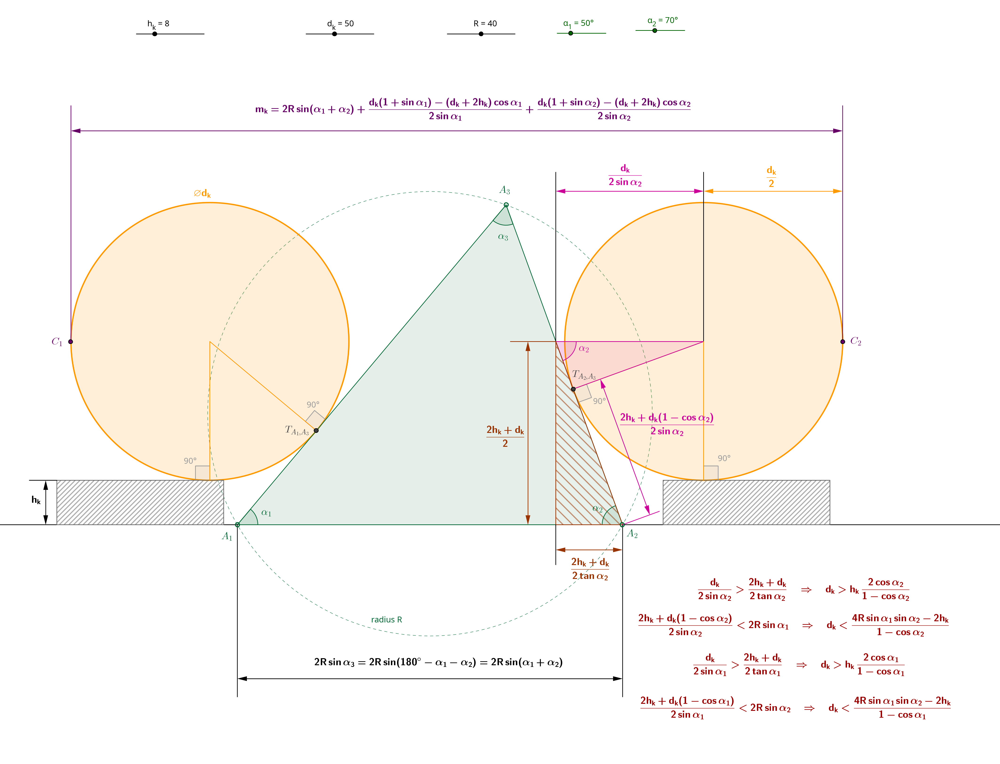

# Prisma

> A tool to accurately assess the geometry of a prismatic rule

Prisma is a tool intended to assess the geometry of a triangular
prismatic rule.  Such rules are used in machining for example to mark
and then scrap machine dovetails.

As the sides of the rules are slanted, often at 45°, 55° or 60°, it is
not straightforward to check accurately their angles.

This tool allows to measure the horizontal distance of two sides at
various heights and to deduce the overall geometry, i.e. the included
angles at the three vertices and the global scale.

## Measurement principle

The cross-section of a prismatic rule is a triangle. If the rules are
properly scraped, their sides should be really close to theoretical
straight line segments. Their vertices, on the other hand, cannot be
assumed to be perfect points joining the segments, they present either
tiny chamfers or radius, and these features are not consistent along
the length of the rule. The vertices therefore cannot reliably be used
as the  basis for measuring the triangular cross-section.

The classical way to measure slanted surfaces is to use a cylindrical
gauge pin of known diameter $d_k$ that will touch the slanted surface
at an intermediate point and to use a caliper or micrometer to measure
up to the external side of the pin. As the contact point between the
cylindrical pin and the slanted surface is an intermediate point and
not one of the vertices, it is accurately located on the slanted surface.
As  the pin is convex, the measurement point is easy to access. As the pin
has known diameter, taking into account its effect on the measurement
is possible, hence allowing to recover the position of the contact point
on the slanted surface.

The following sketch shows how this principle can be used to check
the triangular cross-section of a prismatic rule. The cross-section is
represented by the green triangle with vertices $A_1$, $A_2$ and
$A_3$. The unknowns are the three included angles $\alpha_1$,
$\alpha_2$ and $\alpha_3$ and the radius $R$ of the triangle
circumscribed circle.

This sketch was created using
[Geogebra](https://www.geogebra.org/). The source file is included at
the top of this repository, it has sliders to play with the height
$h_k$, the diameter $d_k$, the radius $R$ and the two angles
$\alpha_1$ and $\alpha_2$ (choosing these two angles enforces the
value of the third angle $\alpha_3$).

In order to be checked, the prismatic rule must be laid on a reference
flat (typically a  surface plate). Two cylindrical gauge pins of known
diameter $d_k$ (displayed in light orange) are laid on two spacer blocks
of height $h_k$ (hatched in black) in such a way they touch the sides of
the prismatic rule with tangential contact points $T_{A_2,A_3}$
and $T_{A_1,A_3}$. The operators use a caliper or a micrometer to perform
measurement $m_k$ as the horizontal  distance between the external points
$C_1$ and $C_2$ of  the cylindrical pins. It is of course possible to not
use any spacer  blocks at all, which corresponds to have $h_k=0$ in all
equations below.

It is important to use the same diameter $d_k$ for both cylindrical
pins and to use the same height $h_k$ for both spacer blocks. This
ensures that the points $C_1$ and $C_2$ are at the same height (which
is $\frac{2h_k+d_k}{2}$) and hence that the measurement is accurate as
the caliper or micrometer anvils touch the cylindrical pins properly.
This property remains fulfilled even despite the contact points
$T_{A_2,A_3}$ and $T_{A_1,A_3}$ between the cylindrical pins and the
prismatic rule are not at the same height with respect to the surface
plate. These contact points would be at the same height only if the
two included angles $\alpha_1$ and $\alpha_2$ were equal. This
measurement principle therefore works regardless of the shape of the
prismatic rule; it works even for irregular prismatic rules.

The expression of the measurement $m_k$ is:
$$m_k=2R\sin(\alpha_1+\alpha_2)+\frac{d_k(1+\sin\alpha_1)-(d_k+2h_k)\cos\alpha_1}{2\sin\alpha_1}+\frac{d_k(1+\sin\alpha_2)-(d_k+2h_k)\cos\alpha_2}{2\sin\alpha_2}$$

This measurement depends only on the radius $R$, on the two angles
$\alpha_1$ and $\alpha_2$, on the cylindrical pins diameter $d_k$ and on
the spacer blocks height $h_k$. Using several different diameters $d_k$ and
several different heights $h_k$ therefore leads to several different
measurements $m_k$. The third angle $\alpha_3$ can be deduced from the
two other ones because the sum of the three angles of a triangle is always
180° (or $\pi$ radians).

In order to be able to perform the measurements $m_k$, a few
conditions must be fulfilled. Given some spacer block height $h_k$, the
diameter $d_k$ of the cylindrical pin must not be too small, otherwise
either the spacer block would come too close to the base of the triangle and
eventually collide with it or the pin would fall between the slanted surface
and the spacer block and would not be laid on the top of the spacer block. On
the other hand having a too large diameter $d_k$ would imply the contact
point between the cylindrical pin and the triangle goes upwards and finally
exceeds the height of the triangle, so there would be no tangential contacts
anymore. For a given spacer block height $h_k$, there are therefore both a
lower and an upper limit on the diameter $d_k$ of the cylindrical pins that
can be used. This can be seen clearly by playing with the sliders in the
Geogebra application.

The conditions for the cylindrical pin on the right hand side are:
$$h_k\frac{2\cos\alpha_2}{1-\cos\alpha_2} < d_k < \frac{4R\sin\alpha_1\sin\alpha_2-2h_k}{1-\cos\alpha_2}$$

Similar conditions apply to the cylindrical pin on the left hand side,
swapping $\alpha_1$ and $\alpha_2$ in the previous equation.

If for example the prismatic rule is an isosceles triangle (all 3
angles are 60° angles or $\pi/3$ radians), then the limits for the
pins diameter are: $2h_k < d_k < 6R - 4h_k$, which is a non-empty
interval only if $h_k < R$.

## How it works

The equation above that gives $m_k$ cannot be inverted directly (i.e. we
cannot find the unknowns $R$, $\alpha_1$ and $\alpha_2$ directly from
several measurements $m_k$). The prisma program works by using several
measurements $m_k$ (as many as the operator is willing to perform), and
finding the set $R$, $\alpha_1$, $\alpha_2$ and $\alpha_3$ that best
match the measurements, using the Levenberg-Marquardt method to solve
the least squares problem. At least three measurements are needed, but
the more, the better.

Using several diameters $d_k$ and several heights $h_k$ allows to
perform multiple measurements with contact points at varying heights
along the sides of the triangle. If a sufficient number of
measurements is taken, then it is theoretically possible to retrieve
the full geometry (i.e. $R$, $\alpha_1$, $\alpha_2$ and $\alpha_3$)
without moving the rule at all. It is however recommended to perform
three series of measurements, a first series with the $(A_1,A_2)$ side
on the surface plate as shown, a second series with the $(A_2,A_3)$
side on the surface plate and a third series with the $(A_3,A_1)$ side
on the surface plate. Having multiple independent series leverages
measurements errors.

The measurements $m_k$ are provided as a simple text file with each
line giving the name of the top vertex ($A_1$, $A_2$ or $A_3$), the
diameter $d_k$ of the pins, the height $h_k$ of the spacer blocks, and the
value $m_k$ that was measured with these settings. The program solves
the least squares problem and provides both the geometrical
characteristics $R$, $\alpha_1$, $\alpha_2$, and $\alpha_3$ with an
estimate of the accuracy of these values as well as the global RMS (Root
Mean Square). It also optionally provides the residuals $m_k -\tilde{m}_k$
where $\tilde{m}_k$ are the theoretical measurements that should have been
obtained with the  estimated values for $R$, $\alpha_1$, $\alpha_2$, and
$\alpha_3$ if the measurements were perfect. This gives an indication of
how good or bad the raw measurements were. The least squares problem solved
is really finding $R$, $\alpha_1$, $\alpha_2$, and $\alpha_3$ that minimize
$\sum_k \left(m_k -\tilde{m}_k\right)^2$.

## License

Prisma is licensed by Luc Maisonobe under the [Apache License, version
2.0](https://www.apache.org/licenses/LICENSE-2.0.html). A copy of this
license is provided in the [LICENSE.txt](LICENSE.txt) file.
